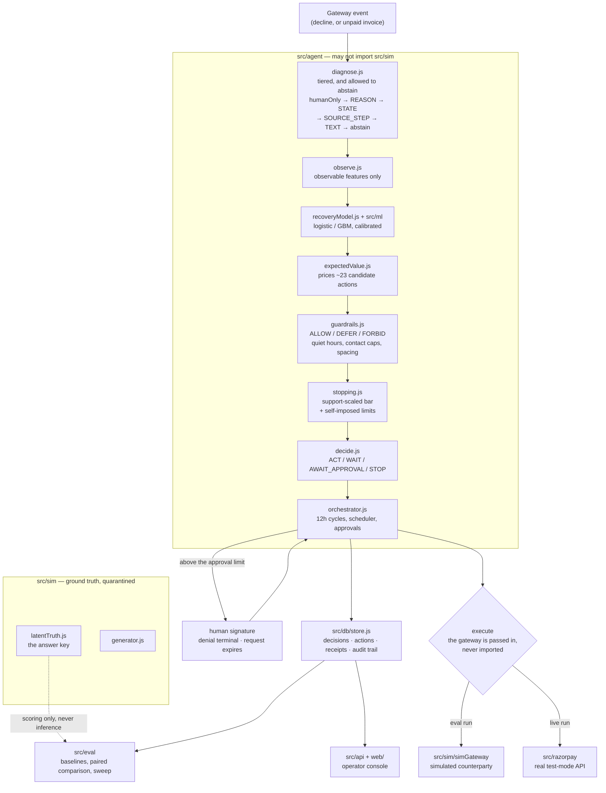

# Rebound

An agent that recovers failed payments — and, more to the point, one that can tell you in rupees why it
did or didn't try.

A failed payment is not one problem. A card with no balance, a card blocked for online use, a lapsed
mandate and a forgotten invoice all arrive looking identical, and the usual answer is to retry the card
three times and send three reminders to everybody. That recovers some money, annoys the customers it
was never going to recover, and leaves nobody able to say which of the two happened. Rebound decides
each case separately, prices every option before choosing one, refuses to act when acting loses money,
asks a human when the amount is large, and writes down the arithmetic either way.

## Two claims, kept apart on purpose

Everything in this repository is one of two claims, and they are never mixed in a single command or on
a single screen.

**The plumbing works, against the real Razorpay API.** `npm run recover-live` takes one real payment
from real decline to real recovery in test mode. On 2026-08-26 it read a genuine decline
(`pay_TSpwzaqXioxWsk`, ₹499, reason `international_transaction_not_allowed`), diagnosed it as
`INSTRUMENT_NOT_ACCEPTED`, priced a retry of that card at **−₹2**, chose instead to offer a different
rail, issued `plink_TUNhyYZ9j1S0nt`, and recovered the money — `pay_TUNqn3thLLX5Vp`, method
`netbanking`, captured, ₹499 of ₹499. The receipts are in [`docs/evidence/`](docs/evidence/). The same
rupee the card refused, on a rail the account accepts.

**The policy is better, measured in simulation.** Nothing about the policy comparison touches Razorpay.
It runs against a simulator whose ground truth the agent is structurally forbidden from reading, which
is the only reason its accuracy numbers mean anything.

Confusing these two is the single easiest way to overstate this project, so the code makes it awkward
to do: no command produces both, and no screen displays both.

## What the agent actually does

Every twelve simulated hours, for every open case, it picks one of four answers — **act now**, **wait**,
**ask a human**, or **stop** — and records the rupee arithmetic behind whichever it picked.

Choosing means pricing. For a typical case it prices 23 candidate actions (retry now, retry at each of
several future slots, payment link or rail-switch nudge or re-auth request, each over WhatsApp, voice,
SMS and email, plus escalate and stop) and ranks them by expected value:

```
EV(action) = P(recover | case, action) × amount × margin − cost(action) − patience_penalty
```

It then takes the best action that survives the guardrails, unless the best action is worth less than
the bar for acting at all, in which case it stops and says so. Three consequences are worth naming,
because they are the behaviours that distinguish it from a retry loop:

It will decide to stop, and it stops while it still has permission to act. On a ₹1,442 lapsed-mandate
case in the demo batch it sent four WhatsApp nudges across ten decisions, watched the value of chasing
decay from ₹147 to **−₹3**, and then closed the case with budget unspent — nought of three retries used,
four of five contacts. It did not run out of permission; it ran out of reasons. On a ₹147 declined card it
stopped on the *first* look having priced all 23 options and taken none: the best was worth ₹1.80 against
a ₹2 bar, and at a 35% contribution margin the entire case was only worth ₹51. Knowing when trying loses
money is most of the job.

It chooses *when*, not just *what*. On a ₹20,857 `do_not_honour` case, retrying immediately ranked
**ninth**. What won was the same retry six hours later: 7.9% against 12.7%, ₹351 better, at no cost.
The record says why in the words it wrote at the time — that later slot lands on payday, and
salary-window proximity is the input the recovery model weighs most heavily.

It stops before spending big money. Above an approval threshold it holds the action and waits for a
signature. A denial is terminal, an unanswered request expires, and it never escalates itself into an
action nobody approved.

## The measured result, stated with its losses

Five worlds × 80 cases on the held-out TEST split, 21 cycles of 12 hours, generator `g140`, money
**incremental** (what the do-nothing baseline recovers anyway is subtracted from every arm — gross
overstates this project by roughly two thirds on the most favourable seed).

Against **B3**, the strongest sensible heuristic: Rebound recovers **1.87× the money on 14% fewer
attempts** (1,379 against 1,610) — **2.19× the money per action**. It is ahead in **3 of 5 worlds**,
not 5. The standard deviation is 3.2× the mean, n = 5, and no p-value is claimed.

Against **B2**, the most aggressive baseline, **Rebound loses on money: 0.71×**, a mean shortfall of
₹50,358, ahead in only 2 of 5 worlds. That is the real result and it is in the repository rather than
buried. What B2 spends to get there is the counterweight: 6,609 attempts and 5,664 messages against
Rebound's 1,379 and 691 — **4.8× the volume for 1.40× the money** — including 2,836 messages inside
quiet hours against zero, and 5,095 contact-cap breaches across 278 customers against zero. Its worst
single customer received 58 contacts, 45 of them in one window, against 4 and 2. B2 is not a policy any
regulated business could ship, and saying "we beat everything" would have required quietly dropping it.

A [26-world assumption sweep](VERIFY.md) moves one conclusion: under a different mix of failure causes
the B3 comparison flips. The joint two-factor worst case tops out at 1.01×.

## Run it

Zero dependencies, no build step, no network required — React and htm are committed files under
`web/vendor/`. Node 22+.

| Command | What it does |
| --- | --- |
| `npm test` | 735 tests, 20 suites, ~50s |
| `npm run eval` | the five-arm paired comparison — this is where the money figures come from |
| `npm run sweep-report` | the 26-world assumption sensitivity sweep |
| `npm run console` | the operator console on `http://127.0.0.1:8787`; you are the approver |
| `npm run replay` | replays the real recovery offline from stored evidence |
| `npm run recover-live` | the real thing; needs `.env` with test-mode keys |
| `npm run doctor` | checks the live test-mode credentials only |

Every command above is written without `--`, and that is deliberate rather than tidy. Reaching console
mode by forwarding the approver flag after `--` is the same run, but whether the flag survives depends on
your npm version and your shell — on a Windows shell it was dropped silently, npm echoed the command with
no arguments, and the server came up in its default measured mode, where the clock buttons are correctly
disabled and therefore look broken. The same shell behaviour turns the forwarded `--replay` into a plain
`npm run recover-live`, which is not an offline replay but a live call against the Razorpay API. Any flag
whose absence changes what a command *does* now lives inside the script; `npm run api` still takes flags
for exploring other seeds and splits, where a dropped flag is visible in the banner and costs nothing.

A `rzp_live_` key is refused outright. `.env` is gitignored and the test suite is wired to a
deliberately nonexistent env path so it can never read real credentials.

The console prints no money totals, on purpose: it pauses mid-horizon so you can act as the approver,
and a truncated run is biased twice in our favour — cases still in flight have had less time to fail,
and frozen approvals are money the policy never spent. Money comes from `npm run eval` or not at all.

## Architecture



The dashed line is the point of the whole layout. `test/boundary.test.js` enforces that nothing in
`src/agent`, `src/api`, `src/razorpay` or `src/ml` imports anything from `src/sim`. The simulator knows
why each payment failed and whether it would have recovered on its own; the agent cannot reach that,
so when the diagnosis engine is scored against latent truth, the score is real. A fake encodes the
beliefs of whoever wrote it and therefore cannot falsify them — the boundary is what stops this from
being a system that grades its own homework.

Money is integer paise everywhere. The browser divides by 100 in exactly one place, and a test enforces
that there is only one such place.

[`docs/architecture.md`](docs/architecture.md) walks the pipeline module by module, and gives the
reasoning behind the decisions above that would be expensive to reverse.

## What is not built

There is no Mongo-backed store (the interface exists, the implementation does not), no live webhook
receiver in production use, and no learning from outcomes — the model is fitted offline and frozen. The
recovery model is trained on simulated outcomes, so its coefficients describe the simulator, not the
Indian payments market. And Rebound cannot pay a customer's bill: it diagnoses, prices, chooses,
issues and reconciles, but the payment itself is the customer's act. A recovery product claiming to
close that loop by itself would be lying.

## Reading further

**If you arrived here from the video,** [`docs/from-the-video.md`](docs/from-the-video.md) maps every
claim you heard to the command that reproduces it and the file that computes it, in the order you heard
them. It is a map, not a second source of truth — where it disagrees with the code, the code wins.

[`VERIFY.md`](VERIFY.md) reproduces every claim above, command by command, and is the file to read if
you want to attack the numbers. [`docs/architecture.md`](docs/architecture.md) is the module-by-module
walkthrough. [`ENGINEERING_LOG.md`](ENGINEERING_LOG.md) is the running record of what broke, including
the defects that flattered the result and were found anyway.
[`docs/explaining-rebound.md`](docs/explaining-rebound.md) covers what is proven versus what is only
measured, and what a fake can and cannot show.
